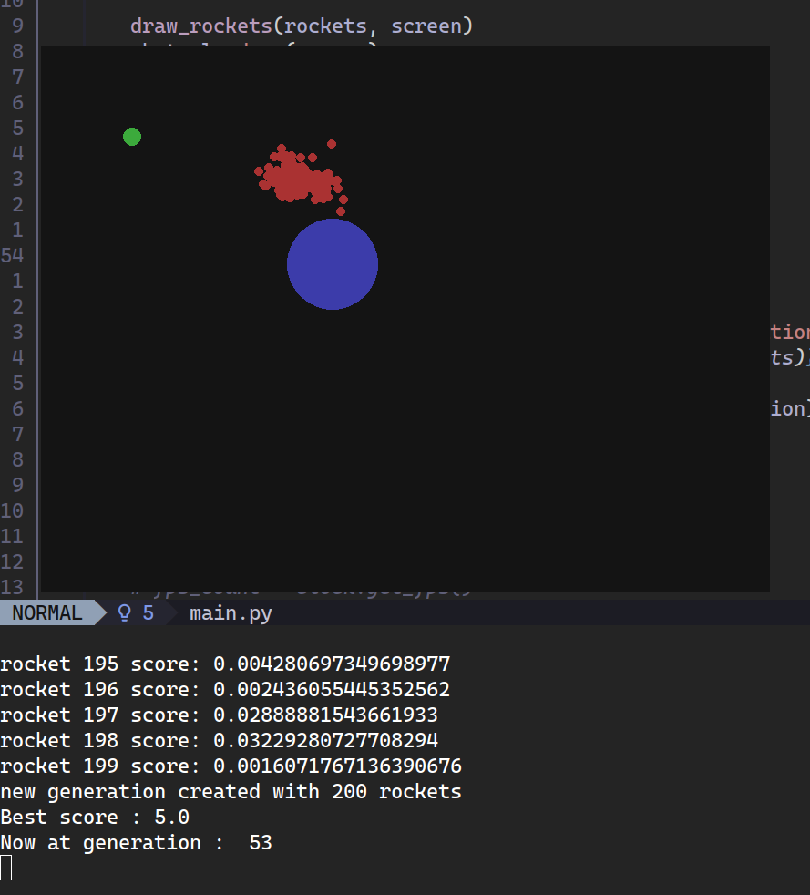

# Rocket Sim

This is a genetic algorithm simulation of autonomous agents (rockets) navigating a 2D environment. The goal is for the population to evolve a trajectory that avoids obstacles and reaches a target coordinate within a fixed timeframe.

## Implementation Details

The project is designed with a strict separation of concerns between physics, data management, and the evolutionary engine.

*   **Physics Engine**: Uses NumPy for vectorized position and velocity updates. 
*   **Genetic Algorithm**: Implements single-point crossover and vectorized mutation masks for efficiency.
*   **Scoring**: Handled via a decoupled fitness evaluator that maps rocket instances to performance scores without polluting the entity classes.
*   **Rendering**: Handled by Pygame, abstracted from the core simulation logic to allow for headless execution if required.

## Project Structure

*   `constants.py`: Centralized configuration for environment dimensions, colors, and simulation parameters.
*   `rocket.py`: Definition of the rocket entity and physics update logic.
*   `game.py`: Management of the population, fitness scoring, and generational transitions.
*   `obstacle.py / reward.py`: Static environmental entities.
*   `main.py`: The entry point and primary simulation loop.

## Requirements

*   Python 3.x
*   NumPy
*   Pygame

## Usage

Run the simulation from the root directory:

```bash
python main.py
```

The simulation will execute indefinitely. Statistics regarding the current generation and best fitness scores are output to the terminal. To adjust the simulation speed or population size, modify the values in `constants.py`.


## Demo




## Results

### 1. Fitness Convergence
The population has successfully "solved" the pathfinding problem. The **Best
Score of 5.0** is being consistently hit and maintained. This indicates that at
least one rocket has developed a DNA sequence that reaches
the target efficiently.

### 2. Elite Stability
The elite selection logic is functioning as intended. In each generation (42, 43, 44), the top 10 rockets (indices 0–9) show a clear hierarchy of high fitness:
*   **Top tier:** 5.0 (Direct hit/Optimal path)
*   **Second tier:** 4.14 and 3.33 (Near-optimal paths)
*   **Third tier:** 3.09

The fact that these exact numbers repeat across generations suggests that these "Elite" DNA sequences are being preserved and used as the primary templates for the rest of the population.

### 3. Genetic Diversity
Despite the dominance of the elite rockets, the population still contains individuals with very low scores (e.g., `0.001` to `0.02`). 
*   **This is a positive indicator.** It proves the **Mutation Rate** is correctly configured. 
*   If every rocket had a high score, the population would be "stagnant" and unable to adapt if the target moved. The low-scoring rockets represent the system's ongoing "exploration" of the environment.

### 5. Execution Performance
The total execution time was **14 minutes and 26 seconds** for 45 generations with a population of 500. 
*   This averages to roughly **19 seconds per generation**. 
*   Given that each generation processes 4,000 frames of physics and collision math for 500 independent agents, this level of performance validates the choice of **NumPy and vectorized operations**. A standard Python list-based approach would likely have taken hours to reach the same point.

**Final Assessment:**
The simulation is successful. The agents have evolved a reliable solution, the elite traits are being preserved, and the system architecture is handling the computational load efficiently. No further adjustments to the mutation rate or selection logic appear necessary for this specific environment.
